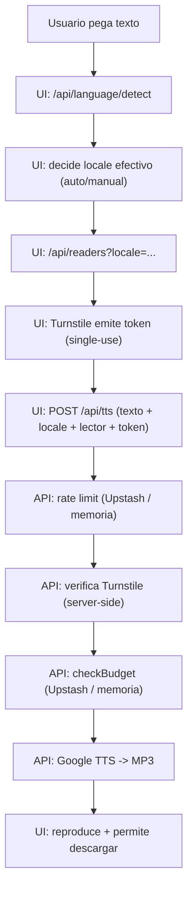

# Arquitectura y decisiones

Este documento explica **qué hace** el proyecto y **por qué** está construido así.

## Resumen

TTS Easy es una web (Next.js) que:

1. Detecta idioma + variante regional (acento) a partir de texto pegado/tecleado.
2. Permite elegir una voz ("lector") acorde al idioma.
3. Genera audio MP3 con Google Cloud Text-to-Speech.
4. Aplica controles anti-abuso (Turnstile + rate limit) y un límite de gasto mensual aproximado.
5. Expone una API comercial `v1` con API key, incluyendo modo prepago EUR (`billing:v2`) con Stripe.

## Piezas principales

- UI (cliente):
  - `src/app/page.tsx`: orquesta estado de texto, detección, lectores, CAPTCHA y reproducción de audio.
  - `src/components/TurnstileBox.tsx`: monta el widget de Cloudflare Turnstile y reporta tokens.
  - `src/components/LanguageBar.tsx`, `src/components/AccentPrompt.tsx`: controles para locale/lector.

- API (backend serverless):
  - `src/app/api/language/detect/route.ts`: endpoint de detección (rápido y barato).
  - `src/app/api/readers/route.ts`: voces disponibles para un locale.
  - `src/app/api/tts/route.ts`: generación de MP3 con protecciones.
  - `src/app/api/v1/tts/route.ts`: endpoint comercial (`Authorization: Bearer <api_key>`), conmutando entre legado y prepago.
  - `src/app/api/v1/billing/summary/route.ts`: resumen mensual (legado/prepago).
  - `src/app/api/v1/billing/topups/checkout-session/route.ts`: crea sesiones Stripe Checkout para recargas.
  - `src/app/api/v1/payments/stripe/webhook/route.ts`: procesa webhooks Stripe con deduplicación.
  - `src/app/api/v1/billing/wallet/route.ts`: saldo y estado de auto-recarga.
  - `src/app/api/v1/billing/transactions/route.ts`: ledger de movimientos wallet.
  - `src/app/api/v1/billing/auto-recharge/route.ts`: configuración de auto-recarga.
  - `src/app/api/portal/**`: capa sesión-usuario para dashboard (`/api/portal/*`).
  - `src/app/auth/callback/route.ts`: callback de magic link (Supabase).
  - `src/app/auth/logout/route.ts`: limpieza de sesión portal.
  - `src/app/api/health/route.ts`: healthcheck.

- Lógica compartida:
  - `src/lib/language.ts`: heurística de idioma + confianza.
  - `src/lib/localeHeuristics.ts`: heurística de variantes regionales (en/es/pt) y etiquetas.
  - `src/lib/readers.ts`: mapea locales a voces concretas de Google y define "tiers" de coste.
  - `src/lib/googleTts.ts`: cliente de Google TTS + chunking + fallback.
  - `src/lib/turnstile.ts`: verificación server-side del token de Turnstile.
  - `src/lib/rateLimit.ts`: rate limit (Upstash Redis o fallback en memoria).
  - `src/lib/costGuard.ts`: budget guard mensual aproximado (Upstash Redis o fallback en memoria).
  - `src/lib/apiBilling.ts`: auth por API key, pricing por tramos, trial, ledger de uso e idempotencia.
  - `src/lib/prepaidBilling.ts`: wallet prepago EUR (`billing:v2`), ledger, auto-recarga e idempotencia.
  - `src/lib/portalAuth.ts`: sesión de portal (cookies HttpOnly, refresh y bootstrap de cuenta).
  - `src/lib/portalStore.ts`: cuentas/API keys en Supabase (DB-first + fallback legacy).
  - `src/lib/supabase/server.ts`: integración REST con Supabase Auth/PostgREST.
  - `src/lib/stripeClient.ts`: inicialización centralizada de Stripe.

## Flujo de generación de audio

### Por qué Turnstile se "remonta" tras cada request

Los tokens de Turnstile son **de un solo uso**. Si el usuario intenta generar audio dos veces seguidas
reutilizando el token anterior, el backend recibe `timeout-or-duplicate` y responde `captcha_failed`.

Para evitarlo, la UI:

- Limpia `captchaToken` tras cada intento.
- Cambia una `key` para remontear el componente Turnstile y forzar un token nuevo.

Referencia: `src/app/page.tsx` (bloque `finally` en `handleGenerateAudio`).

## Detección de idioma y acento: por qué es heurística (y no ML)

Objetivo del MVP: respuesta inmediata, sin dependencias externas y sin coste por request.

- `src/lib/language.ts` detecta idioma base con:
  - stop-words (palabras frecuentes por idioma),
  - "clues" por caracteres/patrones (por ejemplo, `¿`, `¡`, `ñ`),
  - y calcula una confianza.
- `src/lib/localeHeuristics.ts` puntúa variantes regionales (en/es/pt) con pistas tipo "colour" vs "color",
  "ordenador" vs "computadora", etc.

Trade-off:

- Es rápido y suficiente para el caso común, pero no es perfecto (textos cortos/ambiguos pueden fallar).

## Rate limit y budget: por qué Upstash y por qué hay fallback en memoria

En producción, **necesitas** una fuente común de estado para:

- contar requests por IP (rate limiting),
- acumular coste del mes (budget guard).

Por eso se usa **Upstash Redis REST**:

- se integra fácil en Vercel,
- no requiere redes privadas,
- y sirve como estado compartido entre instancias.

Fallback en memoria:

- Existe para que el desarrollo local funcione sin servicios externos.
- No es "fuerte": cada instancia tendría su propio contador.

Referencias:

- `src/lib/rateLimit.ts`
- `src/lib/costGuard.ts`

## Google TTS: por qué runtime Node.js y por qué se "trocea" el texto

La ruta `POST /api/tts` fuerza `export const runtime = "nodejs";` porque:

- el SDK `@google-cloud/text-to-speech` asume runtime Node (no Edge).

`src/lib/googleTts.ts` hace chunking (~4200 chars) porque:

- algunas APIs tienen límites de tamaño por request,
- y concatenar buffers es simple y evita errores por textos largos.

Además:

- intenta primero usar una voz específica (`voice.name`),
- y si falla, hace fallback a solo `languageCode` para aumentar robustez.

## API comercial v1: metrado y cobro

`POST /api/v1/tts` usa la misma capa de síntesis, pero separa facturación de la ruta pública:

- Auth por API key (`Authorization: Bearer ...`).
- Rate limit por `key_id + IP`.
- Idempotencia opcional (`Idempotency-Key`) para evitar doble cargo por retries.
- Metrado por caracteres de entrada (legacy TTS), excluyendo tags `<mark>`.
- Trial inicial por cuenta y pricing por tramos acumulados del mes.
- Agregados diarios/mensuales en Redis para auditoría y reconciliación.

## API comercial prepago (`billing:v2`)

Cuando `API_BILLING_PREPAID_ENABLED=true`, `POST /api/v1/tts` pasa a modo prepago:

- Debita wallet EUR antes de sintetizar.
- Si no hay saldo, intenta auto-recarga (si está habilitada y hay método de pago guardado).
- Si falla la auto-recarga o sigue faltando saldo, devuelve `402 insufficient_balance`.
- Si falla síntesis tras débito, hace rollback con transacción de ajuste.
- Mantiene idempotencia por `Idempotency-Key` para no duplicar cargo.

## Privacidad y datos

Por defecto, la app **no guarda el texto** de usuario.

Sí se guarda (si Upstash está configurado):

- contadores de rate limit por IP y ventana,
- contadores mensuales (caracteres y coste aproximado).

No se guarda:

- contenido del texto,
- audio generado.

## Dónde mirar si quieres cambiar comportamiento

- Cambiar voces / costes:
  - `src/lib/readers.ts` (VOICE_MATRIX + tiers).
- Cambiar rate limit:
  - `src/app/api/tts/route.ts` (parámetros `checkRateLimit`).
- Cambiar presupuesto:
  - `MONTHLY_BUDGET_USD` + `src/lib/costGuard.ts`.
- Cambiar heurísticas de detección:
  - `src/lib/language.ts`, `src/lib/localeHeuristics.ts`.
